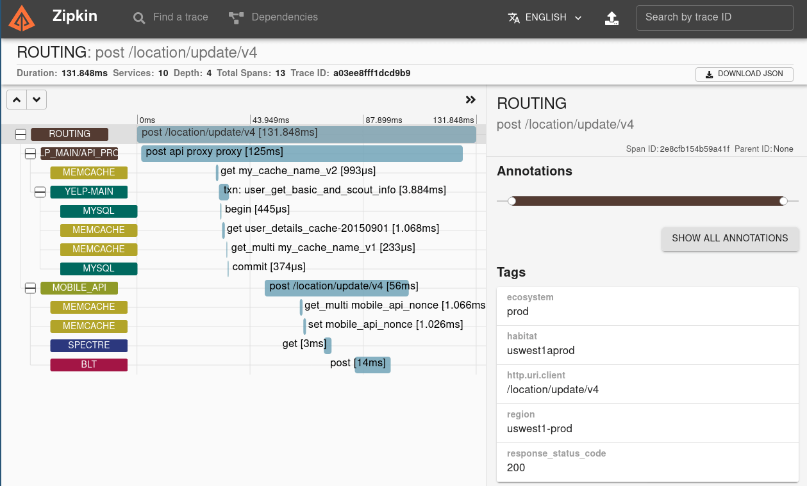

## 介绍
Zipkin 是一个分布式追踪系统。它有助于收集解决服务架构中的延迟问题所需的时间数据。功能包括收集和查找此数据。

如果您在日志文件中有跟踪 ID，则可以直接跳转到它。否则，您可以根据服务、操作名称、标签和持续时间等属性进行查询。会为你总结一些有趣的数据，比如在服务中花费的时间百分比，以及操作是否失败。

Zipkin UI 还提供了一个依赖关系图，显示有多少跟踪请求通过了每个应用程序。这有助于识别聚合行为，包括错误路径或对已弃用服务的调用。

应用程序需要被“检测”以向 Zipkin 报告跟踪数据。这通常意味着配置 [跟踪器或检测库](https://zipkin.io/pages/tracers_instrumentation) 。向 Zipkin 报告数据的最流行方式是通过 HTTP 或 Kafka，但也有许多其他选项，例如 Apache ActiveMQ、gRPC 和 RabbitMQ。提供给 UI 的数据存储在内存中，或者通过支持的后端（例如 Apache Cassandra 或 Elasticsearch）持久存储。
